<div align="center">

<!-- ANIMATED TERMINAL BOOT SEQUENCE -->

<!-- Drop terminal-boot.svg into your profile repo root -->



<br/>

```
 ╔══════════════════════════════════════════════════════════════════════╗
 ║  "Any sufficiently advanced deploy is indistinguishable from magic" ║
 ╚══════════════════════════════════════════════════════════════════════╝
```

</div>

-----

### `> ship_systems --diagnostics`

```
┌──────────────────────────────────────────────────────────────────┐
│  SYSTEM              STATUS        MODULE                       │
├──────────────────────────────────────────────────────────────────┤
│  🟢 Propulsion       ONLINE        Next.js · React · Node.js   │
│  🟢 Navigation       ONLINE        GraphQL · Apollo · Prisma   │
│  🟢 Life Support     ONLINE        Supabase · PostgreSQL · RDS │
│  🟢 Comms Array      ONLINE        REST · Webhooks · SMTP2GO   │
│  🟢 Hull Plating     ONLINE        AWS · Cloudflare · Vercel   │
│  🟢 Weapons Bay      ONLINE        Puppeteer · Automation      │
│  🟡 Coffee Reserves  LOW           ██████░░░░ 60%              │
└──────────────────────────────────────────────────────────────────┘
```

-----

### `> cat /var/log/mission_briefing.md`

```
I build cloud-native SaaS platforms, enterprise integrations, and
workflow automation systems — mostly in the dark, mostly caffeinated,
and almost always with a terminal open.

Currently piloting operations across:
  → Final Orbit      ✦  myfinalorbit.com
  → CitroTech        ✦  citrotech.com
  → Redi-View        ✦  redi-view.com
```

-----

### `> flight_recorder --recent`

```diff
+ [DEPLOY]  Rebuilt client site: WordPress → Next.js 16 (no TypeScript, fight me)
+ [PATCH]   Supabase SSR infinite recursion bug — hunted it, killed it
+ [BUILD]   Form submission tracking dashboard with SMTP2GO webhook ingestion
+ [RECON]   Page monitor with Puppeteer network interception (GraphQL capture)
+ [REFAC]   7,000-line monolithic resolver.js → 33-file modular architecture
! [INTEL]   Apple Security Research Program — zero-day vulnerability recognition
```

-----

### `> scan_sector --interests`

```
 ┌─────────────┐  ┌─────────────┐  ┌─────────────┐  ┌─────────────┐
 │  ⌨️  Mech    │  │  🎮  WoW    │  │  🖥️  PC     │  │  🌑  Dark   │
 │  Keyboards  │  │  Raiding    │  │  Builds     │  │  Mode Only  │
 └─────────────┘  └─────────────┘  └─────────────┘  └─────────────┘
```

-----

### `> uplink --establish`

<div align="center">

[](https://myfinalorbit.com)

</div>

-----

<div align="center">

```
┌──────────────────────────────────────────┐
│                                          │
│   connection established.                │
│   signal strength: ████████████ 100%     │
│                                          │
│   transmission complete.                 │
│   awaiting next command...               │
│                                          │
│   █                                      │
│                                          │
└──────────────────────────────────────────┘
```


</div>
